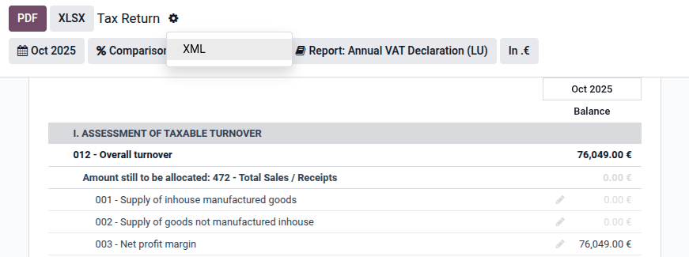

==========
Luxembourg
==========

.. _localizations/luxembourg/modules:

Modules
=======

The following modules are installed automatically with the Luxembourgish localization:

.. list-table::
   :header-rows: 1

   * - Name
     - Technical name
     - Description
   * - :guilabel:`Luxembourg - Accounting`
     - `l10n_lu`
     - Default :ref:`fiscal localization package <fiscal_localizations/packages>`
   * - :guilabel:`Luxembourg - Accounting Reports`
     - `l10n_lu_reports`
     - Country-specific reports

.. note::
   In some cases, such as when upgrading to a version with additional modules, it is possible that
   modules may not be installed automatically. Any missing modules can be manually :ref:`installed
   <general/install>`.

.. _localizations/luxembourg/overview:

Localization overview
=====================

The Luxembourgish localization includes the following features:

- :doc:`../accounting/get_started/chart_of_accounts`: a predefined set of accounts that follows the
  current official accounting standards (PCN 2020)
- :ref:`localizations/luxembourg/taxes`: pre-configured tax rates, including standard (17%),
  reduced (14%, 8%, and 3%) and zero-rated VAT, intra-community, and zero-rated export taxes
- :doc:`../accounting/taxes/fiscal_positions`: automated account and tax adjustments based on
  customer or supplier
- :ref:`localizations/luxembourg/e-invoicing`: E-invoicing with Peppol
- :ref:`localizations/luxembourg/tax-reporting`: detailed overview of your VAT liability, and
  generation of monthly and annual VAT declarations in XML format to upload to the :abbr:`eCDF
  platform (plateforme électronique de Collecte des Données Financières)`
- :ref:`localizations/luxembourg/faia`: generation of audit files in the :abbr:`FAIA (Fichier
  d’Audit Informatisé AED)` (Luxembourgish SAF-T) format

.. _localizations/luxembourg/taxes:

Taxes
-----

The following :doc:`taxes <../accounting/taxes>` are available by default with the Luxembourgish
localization package:

- standard VAT (17%): applied to most goods and services within Luxembourg
- reduced VAT (14%, 8%, and 3%): applied to some goods and services within Luxembourg
- zero-rated VAT: applied to goods and services not subject to VAT
- intra-community VAT: applied to goods and services sold to or purchased from VAT-registered
  persons located in other EU countries
- export tax (0%): zero-rated tax applied to goods and services exported outside Luxembourg

.. _localizations/luxembourg/e-invoicing:

E-invoicing
-----------

Odoo users in Luxembourg can register on the :ref:`accounting/e-invoicing/peppol` network, which
allows exchanging e-invoices and credit notes with other participants on the network.

The e-invoice format in Luxembourg is **BIS Billing 3.0**.

.. important:: E-invoicing via Peppol is mandatory for all B2G transactions in Luxembourg.

.. _localizations/luxembourg/tax-reporting:

Tax reporting
=============

In Luxembourg, companies must submit a VAT declaration on a monthly, quarterly, or annual basis to
the tax office, depending on their turnover. Companies that submit a monthly or quarterly
declaration are also required to submit the annual declaration.

Both monthly/quarterly and annual VAT declarations can be exported as XML files to upload on the
:abbr:`eCDF platform (plateforme électronique de Collecte des Données Financières)`.

Go to :menuselection:`Accounting --> Reporting --> Tax Report`.

In the :icon:`fa-book` :guilabel:`Report` selector, choose :guilabel:`Tax Report (LU)` to view the
monthly/quarterly VAT declaration, or :guilabel:`Annual VAT Declaration (LU)` to view the annual
VAT declaration. Select an appropriate period using the :icon:`fa-calendar` (:guilabel:`Period`)
selector: the monthly/quarterly declaration expects a period of one month or one quarter, while the
annual declaration expects a period of one year.

.. note:: The Annual VAT declaration comes pre-populated with the year's total VAT debit, but
   requires the user to manually distribute this amount into the sales categories defined in the
   report, before exporting to XML. Use the :icon:`fa-pencil` (:guilabel:`Edit`) icon to enter the
   amount for each category.

Once the declaration is correct, click on the :icon:`fa-cog` (:guilabel:`action menu`) icon, then
click :guilabel:`XML` to export it in XML format for upload to eCDF.

.. seealso::
   - :doc:`../accounting/reporting/tax_returns`
   - `Tax office website - VAT declaration <https://guichet.public.lu/en/entreprises/fiscalite/impots-benefices/tva/declarations/declaration-tva.html>`_
   - `Platform for electronic gathering of financial data (eCDF) <http://www.ecdf.lu>`_

.. _localizations/luxembourg/faia:

FAIA audit file export
======================

:abbr:`FAIA (Fichier d’Audit Informatisé AED)` is the Luxembourgish version of the SAF-T format for
accounting data interchange. It allows exporting complete accounting data for a period from a
taxpayer's accounting system to the tax office.

Odoo can generate an XML file in the FAIA format that contains the entire accounting data for a
period.

To generate and download the FAIA file, open :menuselection:`Accounting --> Reporting --> General
Ledger`, choose the desired period, click on the :icon:`fa-cog` (:guilabel:`action menu`) icon, and
click :guilabel:`Export FAIA`.
