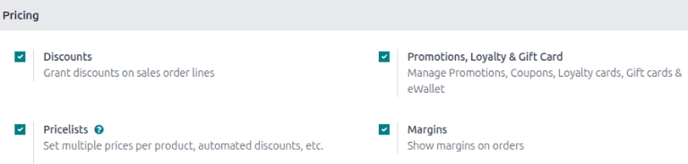
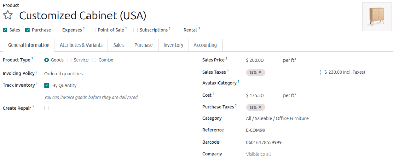
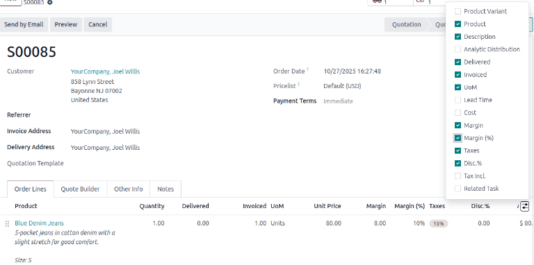

=======
Margins
=======

The sales margin is the profit gained from the sale of a product or service after all the costs
related to it have been accounted for.

In the Odoo **Sales** application, it is possible to show sales margins on quotations and sales
orders. Doing so allows for better management and monitoring of profitability and sustainable
growth.

Configuration
=============

To activate the Margins feature, go to the :menuselection:`Sales app --> Configuration -->
Settings`. In the :guilabel:`Pricing` section, tick the :guilabel:`Margins` checkbox, then click
:guilabel:`Save`.

Calculating margins
-------------------

The sales margin for a product is calculated by subtracting the **Cost Price** from the **Sales
Price**: :math:`Sales~Margin = Sales~Price - Cost~Price`.

.. important::
   Sales margin calculation requires the Cost and Sales Price fields of the product to be filled.

View Margins
============

When creating quotations and sales orders, a new field, :guilabel:`Margin` will be visible at the
bottom of the document. This field displays the total Margin of the order.

To see a product's margin and/or the margin percentage per line item, click the filter button in the
Order Lists section and tick the Margin and Margin(%) checkboxes.

Margin calculation with the pricelist application
=================================================

When applying a pricelist to a quotation or sales order reminder, click :guilabel:`Update Prices`
to refresh the product and margin totals. The margin is recalculated based on the
price-list-adjusted sales price and the product's cost price.

.. tip::
   Another way to visualize the impact of margins on sales orders is to go to :menuselection:`Sales
   app --> Orders --> Quotations`, select the :icon:`fa-area-chart` :guilabel:`(area chart)` icon or
   :icon:`oi-view-pivot` :guilabel:`(pivot)` icon, click :guilabel:`Measures` button and change it
   to :guilabel:`Margin` to see margin contributions across the customer base.

